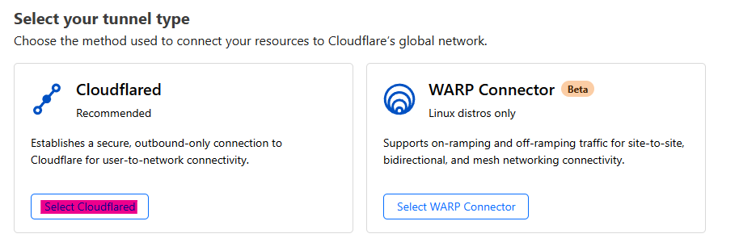

# CC-LAFA

This project is fully managed and developed by :
- Abiyyu
- Ari
- Faris
- Litfan

## Deployment

**Environment =**

- Cloud Computing Platform : [Openstack](https://console.adaptivenetworklab.org)
- Virtual Machine Specification :
1. CPU : 4 Core
2. RAM : 8GB
3. Storage : 50GB
4. OS : Ubuntu 22.04
- Runtime = Node.js
- Database = MariaDB
- Database Manager = PHPMyAdmin
- Public Exposer = Cloudflare Zero Trust

## Setting Up Database

### MariaDB Installation

MariaDB is a SQL Database. The command bellow is how to install MariaDB

```bash
sudo apt install mariadb-server
```

### MariaDB Root Initialization
This command will take to multiple prompt for us to fill. Like for the root password, removing test user, and test database, etc.

```bash
sudo mysql_secure_installation
```

### MariaDB Setup Database & User

Create User named `lafa` with password and accesible from any IP and Domain
```bash
CREATE USER 'lafa'@'%' IDENTIFIED BY '<DATABASE USER PASS>';
```

Grant all privileges on user `lafa`
```bash
>GRANT ALL PRIVILEGES ON *.* TO 'lafa'@'%' WITH GRANT OPTION;
```

Update privileges
```bash
FLUSH PRIVILEGES;
```

List Allowed Host who can accessed User `lafa`, to make sure we can accessed it from Any IP & Domain
```bash
SELECT host FROM mysql.user WHERE User = 'lafa';
```

Create `nodejs` database
```bash
CREATE DATABASE nodejs;
```

Get into `nodejs` database
```bash
USE nodejs;
```

Create `users` table in `nodejs` database
```bash
CREATE TABLE users (
  id INT AUTO_INCREMENT PRIMARY KEY,
  username VARCHAR(255) NOT NULL,
  password VARCHAR(255) NOT NULL UNIQUE,
  type VARCHAR(255) NOT NULL
);
```
#### Add Users to Table
Please change `<user>` and `<pass>`. Also change `<type>` to `user` or `admin`
```bash
INSERT INTO `users` (`id`, `username`, `password`, `type`) VALUES (1, '<user>', '<pass>', '<type>');
```

## Setting Up Database Manager

### PHPMyAdmin & Apache2 Installation

```bash
sudo apt install phpmyadmin apache2
```

### PHPMyAdmin Setup and Integration to MariaDB

Connect PHPMyAdmin to MariaDB, edit `/etc/phpmyadmin/config-db.php`
```bash
sudo nano /etc/phpmyadmin/config-db.php
```
Please change `<DATABASE USER PASS>` to the password of lafa user in database
```bash
$dbuser='lafa';
$dbpass='<DATABASE USER PASS>';
$basepath='';
$dbname='nodejs';
$dbserver='localhost';
$dbport='3306';
$dbtype='mysql';
```

### Open Access of PHPMyAdmin with Apache2

Edit `/etc/phpmyadmin/config-db.php`
```bash
sudo nano /etc/apache2/sites-available/phpmyadmin.conf
```
Insert this script to expose it to a `ServerName` through port `80`
```bash
<VirtualHost *:80>
# phpMyAdmin default Apache configuration
ServerName phpmyadmin.ritufan.site
DocumentRoot /usr/share/phpmyadmin

<Directory /usr/share/phpmyadmin>
    Options SymLinksIfOwnerMatch
    DirectoryIndex index.php

    # limit libapache2-mod-php to files and directories necessary by pma
    <IfModule mod_php7.c>
        php_admin_value upload_tmp_dir /var/lib/phpmyadmin/tmp
        php_admin_value open_basedir /usr/share/phpmyadmin/:/usr/share/doc/phpmyadmin/:/etc/phpmyadmin/:/var/lib/phpmyadmin/:/usr/share/php/:/usr/share/javascript/
    </IfModule>

</Directory>

# Disallow web access to directories that don't need it
<Directory /usr/share/phpmyadmin/templates>
    Require all denied
</Directory>
<Directory /usr/share/phpmyadmin/libraries>
    Require all denied
</Directory>
</VirtualHost>
```

## Deploy App & Exposing to Public

### Run App with Node.js

```bash
node index.js
```

This will make your app accesible from `http://0.0.0.0:3000`. That means any IP Request directed to your `Host` and port `3000` will lead you to the app.

### Expose it to Public

1. You must have a Domain. In our case it's `ritufan.site`
2. Register your Domain into [Dash Cloudflare](https://dash.cloudflare.com)
3. After your domain is registered, go into `Zero Trust` on the Side Panel

4. Go to `Network > Tunnels` on the Side Panel

5. Create Tunnels

6. Select Cloudflared

7. Name your Tunnel, and then Save
8. Install and run Connectors, there will be specific command provided depends on your environment. Select your environment and then run the command on your Host.


9. Route your Tunnel
- Public Hostname will route `Domain` to your App by `IP` and `Port`. For Example : 

- Private Hostname will expose your `Subnet` from the Connector Earlier. For Example :

10. If all is setup correctly, your app should be accessable from the Domain you setup in the Public Hostname.
